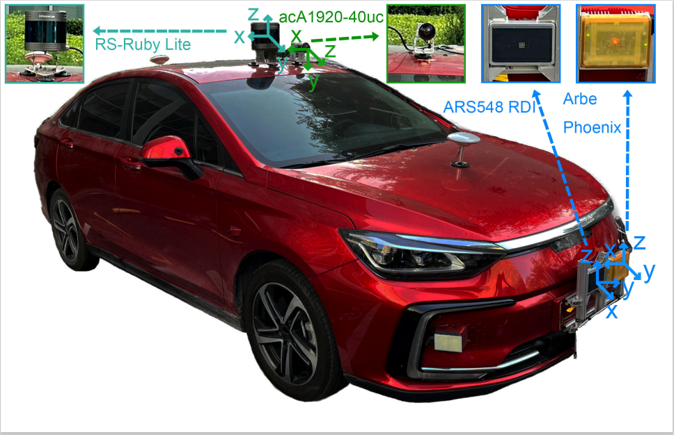
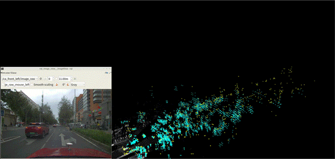
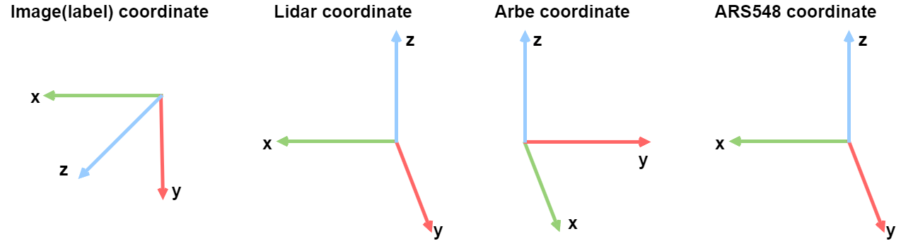
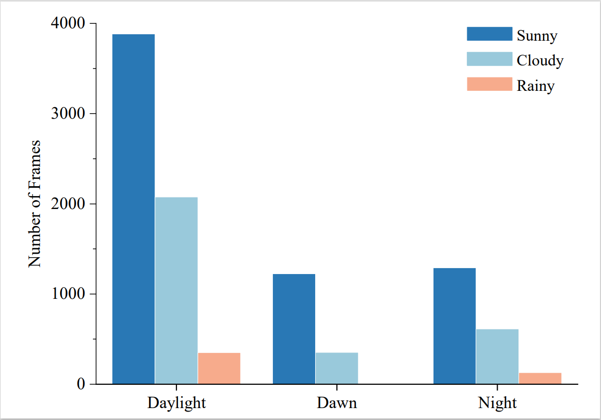
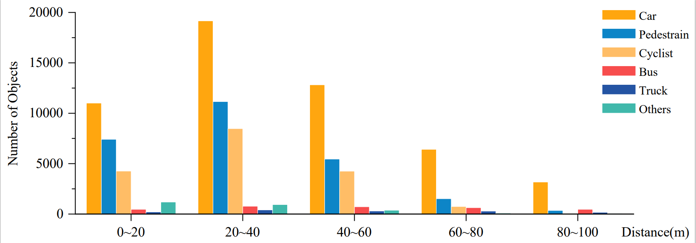

<p align="center">
  
</p>


<p align="center"><font face="Helvetica" size=20.><b>Paper: (https://arxiv.org/pdf/2310.07602.pdf)</b></font></p>

# News
<strong>[2023.10.29]  We have released the dataset download [link](#downloadlink). </strong> 

[2023.10.27] Our Code currently supports some baselines including Voxel RCNN, Second, Pointpillars, RDIOU. Other baselines will be updated soon.

[2023.10.15] Our code and data are still being maintained and will be released soon.

# 1. Introduction
<p style=""text-align:justify; text-justify:interideograph;">
Dual-Radar is a new dataset based on 4D radar that can be used for studies on 3D object detection and tracking in the field of autonomous driving. The perception system of ego vehicle includes a high-resolution camera, a 80-line LiDAR and two up-to-date and different models of 4D radars operating in different modes(Arbe and ARS548). The dataset comprises of raw data collected from ego vehicle, including scenarios such as urban and tunnels, with weather conditions of rainy, cloudy, sunny and so on. Our dataset also includes data from different time periods, including dusk, nighttime, and daytime. Our collected raw data amounts to a total of 12.5 hours, encompassing a total distance of over 600 kilometers. Our dataset covers a route distance of approximately 50 kilometers. It consists of 151 continuous time sequences, with the majority being 20-second sequences, resulting in a total of 10,007 carefully time-synchronized frames.
</p>


<div align=center>
<table class="table-noborder">
  <tr>
    <td align="center">
      <figure>
        
      </figure>
      <p align="center"><font face="Helvetica" size=2.><b>a) Ego vehicle's work scenario</b></font></p>
    </td>
    <td align="center">
      <figure>
        
      </figure>
      <p align="center"><font face="Helvetica" size=2.><b>b) Data projection visualization</b></font></p>
    </td>
  </tr>
</table>
<p align="center"><font face="Helvetica" size=3.><b>Figure 1. Data collection vehicle and data projection visualization</b></font></p>
</div>

### Sensor Configuration 

Our ego vehicle’s configuration and the coordinate relationships between multiple sensors are shown in Figure. 2. The platform of our ego vehicle system consists of a high-resolution camera, an new 80-line LiDAR, and two types of 4D radar. All sensors have been carefully calibrated. The camera and LiDAR are mounted directly above the ego vehicle, while the 4D radars are installed in front of it. Due to the range of horizontal view limitations of the camera and 4D radars, we only collect data from the front of our ego vehicle for annotation. The ARS548 RDI captures data within approximately 120° horizontal field of view and 28° vertical field of view in front of the ego vehicle, while the Arbe Phoenix, operating in middle-range mode, collects data within a 100° horizontal field of view and 30° vertical field of view. The LiDAR collects around the ego vehicle in a 360° manner but only retains the data in the approximate 120° field of view in front of it for annotation. 

<div align=center>

</div>
<p align="center"><font face="Helvetica" size=3.><b>Figure 2. Sensor Configuration and Coordinate Systems</b></font></p>


* The specification of the autonomous vehicle system platform. Our proposed dataset is collected from a high-resolution camera, an 80-line mechanical LiDAR, and two types of 4D radars, the Arbe Phoenix and the ARS548 RDI radar. Our dataset provides GPS information for timing implementation. The sensor configurations are shown in Table 1.

<div align=center>
<p align="center"><font face="Helvetica" size=3.><b>Table 1. The specification of the autonomous vehicle system platform</b></font></p>
<table>
     <tr>
        <td rowspan="2" align=center>Sensors</td>
        <td rowspan="2" align=center>Type</td>
        <td colspan="3" align=center>Resolution</td>
        <td colspan="3" align=center>Fov</td>
        <td rowspan="2">FPS</td>
     </tr>
      <tr>
        <td>Range</td>
        <td>Azimuth</td>
        <td>Elevation</td>
        <td>Range</td>
        <td>Azimuth</td>
        <td>Elevation</td>
     </tr>
      <tr>
        <td align=center>camera</td>
        <td align=center>acA1920-40uc</td>
        <td align=center>-</td>
        <td align=center>1920X</td>
        <td align=center>1200X</td>
        <td align=center>-</td>
        <td align=center>-</td>
        <td align=center>-</td>
        <td align=center>10</td>
     </tr>
     <tr>
        <td align=center>LiDAR</td>
        <td align=center>RS-Ruby Lite</td>
        <td align=center>0.05m</td>
        <td align=center>0.2°</td>
        <td align=center>0.2°</td>
        <td align=center>230m</td>
        <td align=center>360°</td>
        <td align=center>40°</td>
        <td align=center>10</td>
     </tr>
     <tr>
        <td rowspan="2" align=center>4D radar</td>
        <td align=center>ARS 548RDI</td>
        <td align=center>0.22m</td>
        <td align=center>1.2°@0...±15°<br>1.68°@±45°</td>
        <td align=center>2.3°</td>
        <td align=center>300m</td>
        <td align=center>±60°</td>
        <td align=center>±4°@300m<br>±14°@<140m</td>
        <td align=center>20</td>
     </tr>
     <tr>
        <td align=center>Arbe Phoenix</td>
        <td align=center>0.3m</td>
        <td align=center>1.25°</td>
        <td align=center>2°</td>
        <td align=center>153.6m</td>
        <td align=center>100°</td>
        <td align=center>30°</td>
        <td align=center>20</td>
     </tr>
</table>
</div>

* The statistics of number of points cloud per frame. In addition,we analyze the distribution density of the point clouds and the number of point clouds per frame, as shown in Table 2.

<div align=center>
<p align="center"><font face="Helvetica" size=3.><b>Table 2. The statistics of number of points cloud per frame</b></font></p>
<table>
     <tr align=center>
        <td>Transducers</td>
        <td>Minimum Values</td>
        <td>Average Values</td>
        <td>Maximum Values</td>
     </tr>
      <tr align=center>
        <td>LiDAR</td>
        <td>74386</td>
        <td>116096</td>
        <td>133538</td>
     </tr>
      <tr align=center>
        <td>Arbe Phnoeix</td>
        <td>898</td>
        <td>11172</td>
        <td>93721</td>
     </tr>
      <tr align=center>
        <td>ARS548 RDI</td>
        <td>243</td>
        <td>523</td>
        <td>800</td>
     </tr>
</table>
</div>

# 2. Data Acquisition Scenario

* The visualization of raw data collected under different weather conditions and the visualization of annotated 3D bounding boxes are performed separately. The three types of data(Lidar, Arbe and Ars548) are transformed onto a unified coordinate system.
<div align=center>
<table class="table-noborder" align=center>
  <tr>
    <td align="center">
      <figure>
        
      </figure>
      <p align="center"><font face="Helvetica" size=2.><b>a)  Sunny,Daytime</b></font></p>
    </td>
    <td align="center">
      <figure>
        
      </figure>
      <p align="center"><font face="Helvetica" size=2.><b>b)  Sunny,Nightime</b></font></p>
    </td>
  </tr>
  <tr>
    <td align="center">
      <figure>
        
      </figure>
      <p align="center"><font face="Helvetica" size=2.><b>c)  Rainy,Daytime</b></font></p>
    </td>
    <td align="center">
      <figure>
        
      </figure>
      <p align="center"><font face="Helvetica" size=2.><b>d)  Cloudy,Daytime</b></font></p>
    </td>
  </tr>
</table>
<p align="left"><font face="Helvetica" size=3.><b>Figure 3. Visualization of raw data sequences under different weather conditions. </b>On the left is a color RGB image, while on the right side, the cyan represents the Arbe point cloud, the white represents the LiDAR point cloud, and the yellow represents the ARS548 point cloud.</font></p>
</div>

<div align=left>

</div>
<p  align="left"><font face="Helvetica" size=3.><b>Figure 4. Visualization of 3D bounding box projection on data. </b> The first column represents the 3D frame markers on the image. The Column 2, 3, and 4 represent the point cloud from Lidar, Arbe Phoenix radar point cloud, and ARS548 RDI radar point cloud, respectively. Each row represents a scenario type.(a): downtown daytime normal light. (b): downtown daytime backlight. (c): downtown dusk normal light. (d): downtown dusk backlight. (e): downtown clear night. (f): downtown daytime cloudy. (g): downtown rainy day. (h): downtown cloudy dusk. (i): downtown cloudy night. (j): downtown rainy night. (k): daytime tunnel. (l): nighttime tunnel.
</font></p>

<a id="downloadlink"></a>
# 3. Download Link
* Our dataset is freely available to researchers. Please download and sign our [agreement](https://drive.google.com/file/d/1Da3Rvf78989b2-PQKDbHsMb5wUIz3FUp/view?usp=sharing
) and send it to the provided email address (<b>lwang_hit@hotmail.com</b>). You will receive the download link within one week.

* When unzipping the data, please file and organize it by following the format below:
```
    └─Dual Radar
    ├─ImageSets.zip
    ├─testing
    │  ├─testing_arbe.zip
    │  ├─testing_ars548.zip
    │  ├─testing_calib.zip
    │  ├─testing_image.zip
    │  ├─testing_label.zip
    │  ├─testing_robosense.zip
    ├─training
    │  ├─training_arbe.zip
    │  ├─training_ars548.zip
    │  ├─training_calib.zip
    │  ├─training_image.zip
    │  ├─training_label.zip
    │  ├─training_robosense.zip
    └─README_dual_radar.txt
```
* This folder contains 10007 frames of labeled pointclouds and image data. The structure of the folder is shown as blow:
```
    └─Dual Radar
    ├─ImageSets
    │      test.txt
    │      train.txt
    │      trainval.txt
    │      val.txt
    ├─testing
    │  ├─arbe
    │  │      000000.bin	# Raw pointclouds (removed None) of the Arbe.
    │  │      ...............
    │  ├─ars548
    │  │      000000.bin	# Raw pointclouds (removed None) of the ARS548.
    │  │      ...............
    │  ├─calib
    │  │      000000.txt
    │  │      ...............
    │  ├─image
    │  │      000000.png	# Undistort images of the camera.
    │  │      ...............
    │  ├─label
    │  │      000000.txt	# Label in txt format, explain later.
    │  │      ...............
    │  ├─robosense
    │  │      000000.bin	# Raw pointclouds (removed None) of the LiDAR.
    │  │      ...............
    ├─training
    │  ├─arbe
    │  │      000000.bin
    │  │      ...............
    │  ├─ars548
    │  │      000000.bin
    │  │      ...............
    │  ├─calib
    │  │      000000.txt
    │  │      ...............
    │  ├─image
    │  │      000000.png
    │  │      ...............
    │  ├─label
    │  │      000000.txt
    │  │      ...............
    │  ├─robosense
    │  │      000000.bin
    │  │      ...............
    └─README.txt
```
# 4. The Description of Calib Format

* The calib.txt contains tree parts. The dataset consists of two parts: the data part and the alignment calibration file. The data part is image data in png format and point cloud data in bin format. The alignment calibration file includes calibration parameters for the four sensors. The camera-LiDAR, camera-4D radar joint calibration are shown here as examples for illustration.
```
   Dual Radar_cam.Intrinsics.RadialDistortion: Barrel distortion of Dual Radar_cam [ k1, k2, k3 ]
   Dual Radar_cam.Intrinsics.TangentialDistortion: radial distortion of Dual Radar_cam [ p1, p2 ]
   Dual Radar_cam.IntrinsicMatrix: Dual Radar_cam's intrinsic matrix [ af, 0, 0; 0, bf, 0; u, v, 1]
   Dual Radar_LiDAR-->Dual Radar_cam: Dual Radar_lidar to Dual Radar cam's single response matrix P(4×4)
   Dual Radar_radar--> Dual Radar_cam: Dual Radar_radar to Dual Radar_cam rotation matrix + translation matrix P(3×4)
```
# 5. Label Files Discription
* <b>All values (numerical or strings) are separated via spaces, each row corresponds to one object. The 19 columns represent:</b>
```
  Value       Name             Description
  -------------------------------------------------------------------------------------------------------
  1        type               Describes the type of object: 'Car', 'Van', 'Truck', 'Pedestrian',  'Person_sitting', 'Cyclist', 'Tram', 'Misc' or 'DonCare'
  1        truncated          Float from 0 (non-truncated) to 1 (truncated), where truncated refers to the object leaving image boundaries
  1        occluded           Integer (0,1,2,3) indicating occlusion state: 0 = fully visible, 1 = partly ccluded, 2 = largely occluded, 3 = unknown
  1        alpha              Observation angle of object, ranging [-pi..pi]
  4        bbox               2D bounding box of object in the image (0-based index): contains left, top, right, bottom pixel coordinates. 
  3        dimensions         3D object dimensions: height, width, length (in meters).
  3        location           3D object location x,y,z in camera coordinates (in meters).
  1        rotation_y         Rotation ry around Y-axis in camera coordinates [-pi..pi].
  1        score              Only for results: Float,indicating confidence in detection, needed for p/r curves , higher is better.
  1        track_id           Path tracking of the same object
 ```
* Since the labeling work is done in label coordinate, the bounding box out of the image FOV(1920×1080) needs to be cut.

* Location mean the xyz in label coordinate. The same coordinate origen and the relation of axis is shown below.
<p align="center">
  
</p>
<p align="center"><font face="Helvetica" size=3.><b>Figure 5. Illustration of sensor coordinate systems</b></font></p>

*    The difference between rotation_y and alpha are, that rotation_y is directly given in camera coordinates, while alpha also considers the vector from the camera center to the object center, to compute the relative orientation of the object with respect to the camera. For example, a car  which is facing along the X-axis of the camera coordinate system corresponds to rotation_y=0,  no matter where it is located in the X/Z plane (bird's eye view), while alpha is zero only, when  this object is located along the Z-axis of the camera. When moving the car away from the Z-axis, the observation angle will change.

# 6. Data Statistics
<div align=center>

</div>
<p align="center"><font face="Helvetica" size=3.><b>Figure 6. Distribution of weather conditions.</b></font></p>

* We separately count the number of instances for each category in the Dual-Radar dataset and the distribution of different types of weather. About two-thirds of our data are collected under normal weather conditions, and about one-third are collected under rainy and cloudy conditions. We collect 577 frames in rainy weather, which is about 5.5% of the total dataset. The rainy weather data we collect can be used to test the performance of different 4D radars in adverse weather conditions.

<div align=center>

</div>
<p align="center"><font face="Helvetica" size=3.><b>Figure 7. Distribution of instance conditions.</b></font></p>

* We also conduct a statistical analysis of the number of objects with each label at different distance ranges from our vehicle, as shown in Figure 7. Most objects are within 60 meters of our ego vehicle. 

# 7. Getting Started

### Environment
This is the documentation for how to use our detection frameworks with Dual-Radar dataset.
We test the Dual-Radar detection frameworks on the following environment:

* Python 3.8.16 (3.10+ does not support open3d.)
* Ubuntu 18.04/20.04
* Torch 1.10.1+cu113
* CUDA 11.3
* opencv 4.2.0.32

### Preparing The Dataset

* After all files are downloaded, please arrange the workspace directory with the following structure:


* Organize your code structure as follows
```
    Frameworks
      ├── checkpoints
      ├── data
      ├── docs
      ├── pcdet
      ├── output
```
* Organize the dataset according to the following file structure
```
    dual_radar
      ├── lidar
        ├── ImageSets
            ├── train.txt
            ├── trainval.txt
            ├── val.txt
            ├── test.txt
        ├── training
            ├── calib
            ├── image
            ├── label
            ├── velodyne
        ├── testing
            ├── calib
            ├── image
            ├── velodyne
      ├── radar_arbe
        ├── ImageSets
            ├── train.txt
            ├── trainval.txt
            ├── val.txt
            ├── test.txt
        ├── training
            ├── calib
            ├── image
            ├── label
            ├── arbe
        ├── testing
            ├── calib
            ├── image
            ├── arbe
      ├── radar_ars548
        ├── ImageSets
            ├── train.txt
            ├── trainval.txt
            ├── val.txt
            ├── test.txt
        ├── training
            ├── calib
            ├── image
            ├── label
            ├── ars548
        ├── testing
            ├── calib
            ├── image
            ├── ars548
```
### Requirements

* Clone the repository

```
 git clone https://github.com/adept-thu/Dual-Radar.git
 cd Dual-Radar
```

* Create a conda environment
```
conda create -n Dual-Radardet python=3.8.16
conda activate Dual-Radardet
```

* Install PyTorch (We recommend pytorch 1.10.1.)

* Install the dependencies
```
pip install -r requirements.txt
```
* Install Spconv（our cuda version is 113）
```
pip install spconv-cu113
```
* Build packages for Dual-Radardet
```
python setup.py develop
```

### Train & Evaluation
* Generate the data infos by running the following command:
```
using lidar data
python -m pcdet.datasets.dual_radar.dual_radar_dataset create_dual_radar_infos tools/cfgs/dataset_configs/dual_radar_dataset.yaml

using arbe data
python -m pcdet.datasets.dual_radar.dual_radar_dataset_arbe create_dual_radar_infos tools/cfgs/dataset_configs/dual_radar_dataset_arbe.yaml

using ars548 data
python -m pcdet.datasets.dual_radar.dual_radar_dataset_ars548 create_dual_radar_infos tools/cfgs/dataset_configs/dual_radar_dataset_ars548.yaml
```
* To train the model on single GPU, prepare the total dataset and run
```
python train.py --cfg_file ${CONFIG_FILE}
```
* To train the model on multi-GPUs, prepare the total dataset and run
```
sh scripts/dist_train.sh ${NUM_GPUS} --cfg_file ${CONFIG_FILE}
```
* To evaluate the model on single GPU, modify the path and run
```
python test.py --cfg_file ${CONFIG_FILE} --batch_size ${BATCH_SIZE} --ckpt ${CKPT}
```
* To evaluate the model on multi-GPUs, modify the path and run
```
sh scripts/dist_test.sh ${NUM_GPUS} \
    --cfg_file ${CONFIG_FILE} --batch_size ${BATCH_SIZE}
```
### Quick Demo
Here we provide a quick demo to test a pretrained model on the custom point cloud data and visualize the predicted results
* Download the pretrained model as shown in Table 4~8.
* Make sure you have installed the Open3d and mayavi visualization tools. If not, you could install it as follow: 
```
pip install open3d
pip install mayavi
```
* prepare your point cloud data
```
points[:, 3] = 0 
np.save(`my_data.npy`, points)
```
* Run the demo with a pretrained model and  point cloud data as follows
```
python demo.py --cfg_file ${CONFIG_FILE} \
    --ckpt ${CKPT} \
    --data_path ${POINT_CLOUD_DATA}
```

# 8. Experimental Results
<div align=center>
<p align="center"><font face="Helvetica" size=3.><b>Table 3. Multi-modal experimental results(3D@0.5 0.25 0.25)</b></font></p>
<table>
     <tr align=center>
        <td rowspan="3">Baseline</td> 
        <td rowspan="3" align=center>Data</td> 
        <td colspan="3" align=center>Car</td>
        <td colspan="3" align=center>Pedestrain</td>
        <td colspan="3" align=center>Cyclist</td>
        <td rowspan="3" align=center>model pth</td>
    </tr>
    <tr align=center>
        <td colspan="3" align=center>3D@0.5</td>
        <td colspan="3" align=center>3D@0.25</td>
        <td colspan="3" align=center>3D@0.25</td>
    </tr>
    <tr align=center>
        <td>Easy</td>
        <td>Mod.</td>
        <td>Hard</td>
        <td>Easy</td>
        <td>Mod.</td>
        <td>Hard</td>
        <td>Easy</td>
        <td>Mod.</td>
        <td>Hard</td>
    </tr>
    <tr align=center>
        <td rowspan="3">VFF</td> 
        <td>camera+LiDAR</td>
        <td>94.60</td>
        <td>84.14</td>
        <td>78.77</td>
        <td>39.79</td>
        <td>35.99</td>
        <td>36.54</td>
        <td>55.87</td>
        <td>51.55</td>
        <td>51.00</td>
        <td><a href="https://pan.baidu.com/s/17VYvS5iDfse770DR4ILUWQ?pwd=8888">model</a></td>
    </tr>
    <tr align=center>
        <td>camera+Arbe</td>
        <td>31.83</td>
        <td>14.43</td>
        <td>11.30</td>
        <td>0.01</td>
        <td>0.01</td>
        <td>0.01</td>
        <td>0.20</td>
        <td>0.07</td>
        <td>0.08</td>
        <td><a href="https://pan.baidu.com/s/1eob5XHdQbaVStXL2BC26pA?pwd=8888">model</a></td>
    </tr>
    <tr align=center>
        <td>camera+ARS548</td>
        <td>12.60</td>
        <td>6.53</td>
        <td>4.51</td>
        <td>0.00</td>
        <td>0.00</td>
        <td>0.00</td>
        <td>0.00</td>
        <td>0.00</td>
        <td>0.00</td>
        <td><a href="https://pan.baidu.com/s/1W3O5OfmFLxcyYMSgZjKg7Q?pwd=8888">model</a></td>
    </tr>
    <tr align=center>
        <td rowspan="3">M<sup>2</sup>-Fusion</td> 
        <td>LiDAR+Arbe</td>
        <td>89.71</td>
        <td>79.70</td>
        <td>64.32</td>
        <td>27.79</td>
        <td>20.41</td>
        <td>19.58</td>
        <td>41.85</td>
        <td>36.20</td>
        <td>35.14</td>
        <td><a href="https://pan.baidu.com/s/1nRyibZj-3K8R_Q7Yq8nuxw?pwd=8888">model</a></td>
    </tr>
    <tr align=center>
        <td>LiDAR+ARS548</td>
        <td>89.91</td>
        <td>78.17</td>
        <td>62.37</td>
        <td>34.28</td>
        <td>29.89</td>
        <td>29.17</td>
        <td>42.42</td>
        <td>40.92</td>
        <td>39.98</td>
        <td><a href="https://pan.baidu.com/s/1F2qTt33XrvEionzI5WJHrw?pwd=8888">model</a></td>
    </tr>
</table>
</div>


<div align=center>
<p align="center"><font face="Helvetica" size=3.><b>Table 4. Multi-modal experimental results(BEV@0.5 0.25 0.25)</b></font></p>
<table>
     <tr align=center>
        <td rowspan="3">Baseline</td> 
        <td rowspan="3" align=center>Data</td> 
        <td colspan="3" align=center>Car</td>
        <td colspan="3" align=center>Pedestrain</td>
        <td colspan="3" align=center>Cyclist</td>
        <td rowspan="3" align=center>model pth</td>
    </tr>
    <tr align=center>
        <td colspan="3" align=center>BEV@0.5</td>
        <td colspan="3" align=center>BEV@0.25</td>
        <td colspan="3" align=center>BEV@0.25</td>
    </tr>
    <tr align=center>
        <td>Easy</td>
        <td>Mod.</td>
        <td>Hard</td>
        <td>Easy</td>
        <td>Mod.</td>
        <td>Hard</td>
        <td>Easy</td>
        <td>Mod.</td>
        <td>Hard</td>
    </tr>
    <tr align=center>
        <td rowspan="3">VFF</td> 
        <td>camera+Lidar</td>
        <td>94.60</td>
        <td>84.28</td>
        <td>80.55</td>
        <td>40.32</td>
        <td>36.59</td>
        <td>37.28</td>
        <td>55.87</td>
        <td>51.55</td>
        <td>51.00</td>
        <td><a href="https://pan.baidu.com/s/17VYvS5iDfse770DR4ILUWQ?pwd=8888">model</a></td>
    </tr>
    <tr align=center>
        <td>camera+Arbe</td>
        <td>36.09</td>
        <td>17.20</td>
        <td>13.23</td>
        <td>0.01</td>
        <td>0.01</td>
        <td>0.01</td>
        <td>0.20</td>
        <td>0.08</td>
        <td>0.08</td>
        <td><a href="https://pan.baidu.com/s/1eob5XHdQbaVStXL2BC26pA?pwd=8888">model</a></td>
    </tr>
    <tr align=center>
        <td>camera+ARS548</td>
        <td>16.34</td>
        <td>9.58</td>
        <td>6.61</td>
        <td>0.00</td>
        <td>0.00</td>
        <td>0.00</td>
        <td>0.00</td>
        <td>0.00</td>
        <td>0.00</td>
        <td><a href="https://pan.baidu.com/s/1W3O5OfmFLxcyYMSgZjKg7Q?pwd=8888">model</a></td>
    </tr>
    <tr align=center>
        <td rowspan="3">M<sup>2</sup>-Fusion</td> 
        <td>LiDAR+Arbe</td>
        <td>90.91</td>
        <td>85.73</td>
        <td>70.16</td>
        <td>28.05</td>
        <td>20.68</td>
        <td>20.47</td>
        <td>53.06</td>
        <td>47.83</td>
        <td>46.32</td>
        <td><a href="https://pan.baidu.com/s/1nRyibZj-3K8R_Q7Yq8nuxw?pwd=8888">model</a></td>
    </tr>
    <tr align=center>
        <td>LiDAR+ARS548</td>
        <td>91.14</td>
        <td>82.57</td>
        <td>66.65</td>
        <td>34.98</td>
        <td>30.28</td>
        <td>29.92</td>
        <td>43.12</td>
        <td>41.57</td>
        <td>40.29</td>
        <td><a href="https://pan.baidu.com/s/1F2qTt33XrvEionzI5WJHrw?pwd=8888">model</a></td>
    </tr>
</table>
</div>


<div align=center>
<p align="center"><font face="Helvetica" size=3.><b>Table 5. Single-modal experimental results(3D@0.5 0.25 0.25)</b></font></p>
<table>
     <tr align=center>
        <td rowspan="3">Baseline</td> 
        <td rowspan="3" align=center>Data</td> 
        <td colspan="3" align=center>Car</td>
        <td colspan="3" align=center>Pedestrain</td>
        <td colspan="3" align=center>Cyclist</td>
        <td rowspan="3" align=center>model pth</td>
    </tr>
    <tr>
        <td colspan="3" align=center>3D@0.5</td>
        <td colspan="3" align=center>3D@0.25</td>
        <td colspan="3" align=center>3D@0.25</td>
    </tr>
    <tr align=center>
        <td>Easy</td>
        <td>Mod.</td>
        <td>Hard</td>
        <td>Easy</td>
        <td>Mod.</td>
        <td>Hard</td>
        <td>Easy</td>
        <td>Mod.</td>
        <td>Hard</td>
    </tr>
    <tr align=center>
        <td rowspan="3">Pointpillars</td> 
        <td>LiDAR</td>
        <td>81.78</td>
        <td>55.40</td>
        <td>44.53</td>
        <td>43.22</td>
        <td>38.87</td>
        <td>38.45</td>
        <td>25.60</td>
        <td>24.35</td>
        <td>23.97</td>
        <td><a href="https://pan.baidu.com/s/1W-qI2s1nPcbQgWqzOCo-ww?pwd=8888">model</a></td>
    </tr>
    <tr align=center>
        <td>Arbe</td>
        <td>49.06</td>
        <td>27.64</td>
        <td>18.63</td>
        <td>0.00</td>
        <td>0.00</td>
        <td>0.00</td>
        <td>0.19</td>
        <td>0.12</td>
        <td>0.12</td>
        <td><a href="https://pan.baidu.com/s/1hFSzN5A4SWeJMEQHQ1nmWA?pwd=8888">model</a></td>
    </tr>
    <tr align=center>
        <td>ARS548</td>
        <td>11.94</td>
        <td>6.12</td>
        <td>3.76</td>
        <td>0.00</td>
        <td>0.00</td>
        <td>0.00</td>
        <td>0.99</td>
        <td>0.63</td>
        <td>0.58</td>
        <td><a href="https://pan.baidu.com/s/1L6i4VP4tvfLXzTiTKv6klg?pwd=8888">model</a></td>
    </tr>
    <tr align=center>
        <td rowspan="3">RDIou</td> 
        <td>LiDAR</td>
        <td>63.43</td>
        <td>40.80</td>
        <td>32.92</td>
        <td>33.71</td>
        <td>29.35</td>
        <td>28.96</td>
        <td>38.26</td>
        <td>35.62</td>
        <td>35.02</td>
        <td><a href="https://pan.baidu.com/s/1dLE5AIS7LObDmD14sVRjNQ?pwd=8888">model</a></td>
    </tr>
    <tr align=center>
        <td>Arbe</td>
        <td>51.49</td>
        <td>26.74</td>
        <td>17.83</td>
        <td>0.00</td>
        <td>0.00</td>
        <td>0.00</td>
        <td>0.51</td>
        <td>0.37</td>
        <td>0.35</td>
        <td><a href="https://pan.baidu.com/s/1UYwhCQqUWTbdlWKN3ioBjg?pwd=8888">model</a></td>
    </tr>
    <tr align=center>
        <td>ARS548</td>
        <td>5.96</td>
        <td>3.77</td>
        <td>2.29</td>
        <td>0.00</td>
        <td>0.00</td>
        <td>0.00</td>
        <td>0.21</td>
        <td>0.15</td>
        <td>0.15</td>
        <td><a href="https://pan.baidu.com/s/1J5dI4lOPSNrHo6BWO3kwxw?pwd=8888">model</a></td>
   </tr>
   <tr align=center>
        <td rowspan="3">VoxelRCNN</td> 
        <td>LiDAR</td>
        <td>86.41</td>
        <td>56.91</td>
        <td>42.38</td>
        <td>52.65</td>
        <td>46.33</td>
        <td>45.80</td>
        <td>38.89</td>
        <td>35.13</td>
        <td>34.52</td>
        <td><a href="https://pan.baidu.com/s/19xPzaxDaITnmcWRebokCQA?pwd=8888">model</a></td>
   </tr>
   <tr align=center>
        <td>Arbe</td>
        <td>55.47</td>
        <td>30.17</td>
        <td>19.82</td>
        <td>0.03</td>
        <td>0.02</td>
        <td>0.02</td>
        <td>0.15</td>
        <td>0.06</td>
        <td>0.06</td>
        <td><a href="https://pan.baidu.com/s/1Y7ETKcL19XJgLkpit19DKQ?pwd=8888">model</a></td>
   </tr>
   <tr align=center>
        <td>ARS548</td>
        <td>18.37</td>
        <td>8.24</td>
        <td>4.97</td>
        <td>0.00</td>
        <td>0.00</td>
        <td>0.00</td>
        <td>0.24</td>
        <td>0.21</td>
        <td>0.21</td>
        <td><a href="https://pan.baidu.com/s/1dhy0_LpzQpVkAI-hoDFbbQ?pwd=8888">model</a></td>
   </tr>
   <tr align=center>
        <td rowspan="3">Cas-V</td> 
        <td>LiDAR</td>
        <td>80.60</td>
        <td>58.98</td>
        <td>49.83</td>
        <td>55.43</td>
        <td>49.11</td>
        <td>48.47</td>
        <td>42.84</td>
        <td>40.32</td>
        <td>39.09</td>
        <td><a href="https://pan.baidu.com/s/1pBimu_gmWZUk9QLLYD7KTA?pwd=8888">model</a></td>
   </tr>
   <tr align=center>
        <td>Arbe</td>
        <td>27.96</td>
        <td>10.27</td>
        <td>6.21</td>
        <td>0.02</td>
        <td>0.01</td>
        <td>0.01</td>
        <td>0.05</td>
        <td>0.04</td>
        <td>0.04</td>
        <td><a href="https://pan.baidu.com/s/1TtCPrz4DIeeMMOuHN9JhYg?pwd=8888">model</a></td>
   </tr>
   <tr align=center>
        <td>ARS548</td>
        <td>7.71</td>
        <td>3.05</td>
        <td>1.86</td>
        <td>0.00</td>
        <td>0.00</td>
        <td>0.00</td>
        <td>0.08</td>
        <td>0.06</td>
        <td>0.06</td>
        <td><a href="https://pan.baidu.com/s/1T4ryoltUeHsQj87YTl9I3g?pwd=8888">model</a></td>
   </tr>
   <tr align=center>
        <td rowspan="3">Cas-T</td> 
        <td>LiDAR</td>
        <td>73.41</td>
        <td>45.74</td>
        <td>35.09</td>
        <td>58.84</td>
        <td>52.08</td>
        <td>51.45</td>
        <td>35.42</td>
        <td>33.78</td>
        <td>33.36</td>
        <td><a href="https://pan.baidu.com/s/1IAylSAjxN02Jv78VNvulMA?pwd=8888">model</a></td>
   </tr>
   <tr align=center>
        <td>Arbe</td>
        <td>14.15</td>
        <td>6.38</td>
        <td>4.27</td>
        <td>0.00</td>
        <td>0.00</td>
        <td>0.00</td>
        <td>0.09</td>
        <td>0.06</td>
        <td>0.05</td>
        <td><a href="https://pan.baidu.com/s/1XuH30eIaKa_VQijiYBuGxg?pwd=8888">model</a></td>
   </tr>
   <tr align=center>
        <td>ARS548</td>
        <td>3.16</td>
        <td>1.60</td>
        <td>1.00</td>
        <td>0.00</td>
        <td>0.00</td>
        <td>0.00</td>
        <td>0.36</td>
        <td>0.20</td>
        <td>0.20</td>
        <td><a href="https://pan.baidu.com/s/1mQxorPnFHp_JMVmJBisRtA?pwd=8888">model</a></td>
   </tr>
</table>
</div>


<div align=center>
<p align="center"><font face="Helvetica" size=3.><b>Table 6. Single-modal experimental results(BEV@0.5 0.25 0.25)</b></font></p>
<table>
     <tr align=center>
        <td rowspan="3">Baseline</td> 
        <td rowspan="3" align=center>Data</td> 
        <td colspan="3" align=center>Car</td>
        <td colspan="3" align=center>Pedestrain</td>
        <td colspan="3" align=center>Cyclist</td>
        <td rowspan="3" align=center>model pth</td>
    </tr>
    <tr align=center>
        <td colspan="3" align=center>BEV@0.5</td>
        <td colspan="3" align=center>BEV@0.25</td>
        <td colspan="3" align=center>BEV@0.25</td>
    </tr>
    <tr align=center>
        <td>Easy</td>
        <td>Mod.</td>
        <td>Hard</td>
        <td>Easy</td>
        <td>Mod.</td>
        <td>Hard</td>
        <td>Easy</td>
        <td>Mod.</td>
        <td>Hard</td>
    </tr>
    <tr align=center>
        <td rowspan="3">Pointpillars</td> 
        <td>LiDAR</td>
        <td>81.81</td>
        <td>55.49</td>
        <td>45.69</td>
        <td>43.60</td>
        <td>39.59</td>
        <td>38.92</td>
        <td>38.78</td>
        <td>38.74</td>
        <td>38.42</td>
        <td><a href="https://pan.baidu.com/s/1W-qI2s1nPcbQgWqzOCo-ww?pwd=8888">model</a></td>
    </tr>
    <tr align=center>
        <td>Arbe</td>
        <td>54.63</td>
        <td>35.09</td>
        <td>25.19</td>
        <td>0.00</td>
        <td>0.00</td>
        <td>0.00</td>
        <td>0.41</td>
        <td>0.24</td>
        <td>0.23</td>
        <td><a href="https://pan.baidu.com/s/1hFSzN5A4SWeJMEQHQ1nmWA?pwd=8888">model</a></td>
    </tr>
    <tr align=center>
        <td>ARS548</td>
        <td>14.40</td>
        <td>8.14</td>
        <td>5.26</td>
        <td>0.00</td>
        <td>0.00</td>
        <td>0.00</td>
        <td>2.27</td>
        <td>1.64</td>
        <td>1.53</td>
        <td><a href="https://pan.baidu.com/s/1L6i4VP4tvfLXzTiTKv6klg?pwd=8888">model</a></td>
    </tr>
    <tr align=center>
        <td rowspan="3">RDIou</td> 
        <td>LiDAR</td>
        <td>63.44</td>
        <td>41.25</td>
        <td>33.74</td>
        <td>33.97</td>
        <td>29.62</td>
        <td>29.22</td>
        <td>49.33</td>
        <td>47.48</td>
        <td>46.85</td>
        <td><a href="https://pan.baidu.com/s/1dLE5AIS7LObDmD14sVRjNQ?pwd=8888">model</a></td> 
    </tr>
    <tr align=center>
        <td>Arbe</td>
        <td>55.27</td>
        <td>31.48</td>
        <td>21.80</td>
        <td>0.01</td>
        <td>0.01</td>
        <td>0.01</td>
        <td>0.84</td>
        <td>0.66</td>
        <td>0.65</td>
        <td><a href="https://pan.baidu.com/s/1UYwhCQqUWTbdlWKN3ioBjg?pwd=8888">model</a></td>
    </tr>
    <tr align=center>
        <td>ARS548</td>
        <td>7.13</td>
        <td>5.00</td>
        <td>3.21</td>
        <td>0.00</td>
        <td>0.00</td>
        <td>0.00</td>
        <td>0.61</td>
        <td>0.46</td>
        <td>0.44</td>
        <td><a href="https://pan.baidu.com/s/1J5dI4lOPSNrHo6BWO3kwxw?pwd=8888">model</a></td>
   </tr>
   <tr align=center>
        <td rowspan="3">VoxelRCNN</td> 
        <td>LiDAR</td>
        <td>86.41</td>
        <td>56.95</td>
        <td>42.43</td>
        <td>41.21</td>
        <td>53.50</td>
        <td>45.93</td>
        <td>47.47</td>
        <td>45.43</td>
        <td>43.85</td>
        <td><a href="https://pan.baidu.com/s/19xPzaxDaITnmcWRebokCQA?pwd=8888">model</a></td> 
   </tr>
   <tr align=center>
        <td>Arbe</td>
        <td>59.32</td>
        <td>34.86</td>
        <td>23.77</td>
        <td>0.02</td>
        <td>0.02</td>
        <td>0.02</td>
        <td>0.21</td>
        <td>0.15</td>
        <td>0.15</td>
        <td><a href="https://pan.baidu.com/s/1Y7ETKcL19XJgLkpit19DKQ?pwd=8888">model</a></td>
   </tr>
   <tr align=center>
        <td>ARS548</td>
        <td>21.34</td>
        <td>9.81</td>
        <td>6.11</td>
        <td>0.00</td>
        <td>0.00</td>
        <td>0.00</td>
        <td>0.33</td>
        <td>0.30</td>
        <td>0.30</td>
        <td><a href="https://pan.baidu.com/s/1dhy0_LpzQpVkAI-hoDFbbQ?pwd=8888">model</a></td>
   </tr>
   <tr align=center>
        <td rowspan="3">Cas-V</td> 
        <td>LiDAR</td>
        <td>80.60</td>
        <td>59.12</td>
        <td>51.17</td>
        <td>55.66</td>
        <td>49.35</td>
        <td>48.72</td>
        <td>51.51</td>
        <td>50.03</td>
        <td>49.35</td>
        <td><a href="https://pan.baidu.com/s/1pBimu_gmWZUk9QLLYD7KTA?pwd=8888">model</a></td>
   </tr>
   <tr align=center>
        <td>Arbe</td>
        <td>30.52</td>
        <td>12.28</td>
        <td>7.82</td>
        <td>0.02</td>
        <td>0.02</td>
        <td>0.02</td>
        <td>0.13</td>
        <td>0.05</td>
        <td>0.05</td>
        <td><a href="https://pan.baidu.com/s/1TtCPrz4DIeeMMOuHN9JhYg?pwd=8888">model</a></td>
   </tr>
   <tr align=center>
        <td>ARS548</td>
        <td>8.81</td>
        <td>3.74</td>
        <td>2.38</td>
        <td>0.00</td>
        <td>0.00</td>
        <td>0.00</td>
        <td>0.25</td>
        <td>0.21</td>
        <td>0.19</td>
        <td><a href="https://pan.baidu.com/s/1T4ryoltUeHsQj87YTl9I3g?pwd=8888">model</a></td>
   </tr>
   <tr align=center>
        <td rowspan="3">Cas-T</td> 
        <td>LiDAR</td>
        <td>73.42</td>
        <td>45.79</td>
        <td>35.31</td>
        <td>59.06</td>
        <td>52.36</td>
        <td>51.74</td>
        <td>44.35</td>
        <td>44.41</td>
        <td>42.88</td>
        <td><a href="https://pan.baidu.com/s/1IAylSAjxN02Jv78VNvulMA?pwd=8888">model</a></td>
   </tr>
   <tr align=center>
        <td>Arbe</td>
        <td>22.85</td>
        <td>13.06</td>
        <td>9.18</td>
        <td>0.00</td>
        <td>0.00</td>
        <td>0.00</td>
        <td>0.17</td>
        <td>0.08</td>
        <td>0.08</td>
        <td><a href="https://pan.baidu.com/s/1XuH30eIaKa_VQijiYBuGxg?pwd=8888">model</a></td>
   </tr>
   <tr align=center>
        <td>ARS548</td>
        <td>4.21</td>
        <td>2.21</td>
        <td>1.49</td>
        <td>0.00</td>
        <td>0.00</td>
        <td>0.00</td>
        <td>0.68</td>
        <td>0.43</td>
        <td>0.42</td>
        <td><a href="https://pan.baidu.com/s/1mQxorPnFHp_JMVmJBisRtA?pwd=8888">model</a></td>
   </tr>
</table>
</div>

<div align=center>
<p align="center"><font face="Helvetica" size=3.><b>Table 7. Single-modal experimental results in the rainy scenario(3D@0.5 0.25 0.25)</b></font></p>
<table>
     <tr align=center>
        <td rowspan="3">Baseline</td> 
        <td rowspan="3" align=center>Data</td> 
        <td colspan="3" align=center>Car</td>
        <td colspan="3" align=center>Pedestrain</td>
        <td colspan="3" align=center>Cyclist</td>
        <td rowspan="3" align=center>model pth</td>
    </tr>
    <tr>
        <td colspan="3" align=center>3D@0.5</td>
        <td colspan="3" align=center>3D@0.25</td>
        <td colspan="3" align=center>3D@0.25</td>
    </tr>
    <tr align=center>
        <td>Easy</td>
        <td>Mod.</td>
        <td>Hard</td>
        <td>Easy</td>
        <td>Mod.</td>
        <td>Hard</td>
        <td>Easy</td>
        <td>Mod.</td>
        <td>Hard</td>
    </tr>
    <tr align=center>
        <td rowspan="3">Pointpillars</td> 
        <td>LiDAR</td>
        <td>60.57</td>
        <td>44.31</td>
        <td>41.91</td>
        <td>32.74</td>
        <td>28.82</td>
        <td>28.67</td>
        <td>29.12</td>
        <td>25.75</td>
        <td>24.24</td>
        <td><a href="https://pan.baidu.com/s/1W-qI2s1nPcbQgWqzOCo-ww?pwd=8888">model</a></td>
    </tr>
    <tr align=center>
        <td>Arbe</td>
        <td>68.24</td>
        <td>48.98</td>
        <td>42.80</td>
        <td>0.00</td>
        <td>0.00</td>
        <td>0.00</td>
        <td>0.19</td>
        <td>0.10</td>
        <td>0.09</td>
        <td><a href="https://pan.baidu.com/s/1hFSzN5A4SWeJMEQHQ1nmWA?pwd=8888">model</a></td>
    </tr>
    <tr align=center>
        <td>ARS548</td>
        <td>11.87</td>
        <td>8.41</td>
        <td>7.32</td>
        <td>0.11</td>
        <td>0.09</td>
        <td>0.08</td>
        <td>0.93</td>
        <td>0.36</td>
        <td>0.30</td>
        <td><a href="https://pan.baidu.com/s/1L6i4VP4tvfLXzTiTKv6klg?pwd=8888">model</a></td>
    </tr>
    <tr align=center>
        <td rowspan="3">RDIou</td> 
        <td>LiDAR</td>
        <td>44.93</td>
        <td>39.32</td>
        <td>39.09</td>
        <td>24.28</td>
        <td>21.63</td>
        <td>21.43</td>
        <td>52.64</td>
        <td>43.92</td>
        <td>42.04</td>
        <td><a href="https://pan.baidu.com/s/1dLE5AIS7LObDmD14sVRjNQ?pwd=8888">model</a></td>
    </tr>
    <tr align=center>
        <td>Arbe</td>
        <td>67.81</td>
        <td>49.59</td>
        <td>43.24</td>
        <td>0.00</td>
        <td>0.00</td>
        <td>0.00</td>
        <td>0.38</td>
        <td>0.30</td>
        <td>0.28</td>
        <td><a href="https://pan.baidu.com/s/1UYwhCQqUWTbdlWKN3ioBjg?pwd=8888">model</a></td>
    </tr>
    <tr align=center>
        <td>ARS548</td>
        <td>5.87</td>
        <td>5.48</td>
        <td>4.68</td>
        <td>0.00</td>
        <td>0.00</td>
        <td>0.00</td>
        <td>0.09</td>
        <td>0.01</td>
        <td>0.01</td>
        <td><a href="https://pan.baidu.com/s/1J5dI4lOPSNrHo6BWO3kwxw?pwd=8888">model</a></td>
   </tr>
</table>
</div>

<div align=center>
<p align="center"><font face="Helvetica" size=3.><b>Table 8. Single-modal experimental results(BEV@0.5 0.25 0.25) in the rainy scenario</b></font></p>
<table>
     <tr align=center>
        <td rowspan="3">Baseline</td> 
        <td rowspan="3" align=center>Data</td> 
        <td colspan="3" align=center>Car</td>
        <td colspan="3" align=center>Pedestrain</td>
        <td colspan="3" align=center>Cyclist</td>
        <td rowspan="3" align=center>model pth</td>
    </tr>
    <tr>
        <td colspan="3" align=center>BEV@0.5</td>
        <td colspan="3" align=center>BEV@0.25</td>
        <td colspan="3" align=center>BEV@0.25</td>
    </tr>
    <tr align=center>
        <td>Easy</td>
        <td>Mod.</td>
        <td>Hard</td>
        <td>Easy</td>
        <td>Mod.</td>
        <td>Hard</td>
        <td>Easy</td>
        <td>Mod.</td>
        <td>Hard</td>
    </tr>
    <tr align=center>
        <td rowspan="3">Pointpillars</td> 
        <td>LiDAR</td>
        <td>60.57</td>
        <td>44.56</td>
        <td>42.49</td>
        <td>32.74</td>
        <td>28.82</td>
        <td>28.67</td>
        <td>44.39</td>
        <td>40.36</td>
        <td>38.64</td>
        <td><a href="https://pan.baidu.com/s/1W-qI2s1nPcbQgWqzOCo-ww?pwd=8888">model</a></td>
    </tr>
    <tr align=center>
        <td>Arbe</td>
        <td>74.50</td>
        <td>59.68</td>
        <td>54.34</td>
        <td>0.00</td>
        <td>0.00</td>
        <td>0.00</td>
        <td>0.32</td>
        <td>0.16</td>
        <td>0.15</td>
        <td><a href="https://pan.baidu.com/s/1hFSzN5A4SWeJMEQHQ1nmWA?pwd=8888">model</a></td>
    </tr>
    <tr align=center>
        <td>ARS548</td>
        <td>14.16</td>
        <td>11.32</td>
        <td>9.82</td>
        <td>0.11</td>
        <td>0.09</td>
        <td>0.08</td>
        <td>2.26</td>
        <td>1.43</td>
        <td>1.20</td>
        <td><a href="https://pan.baidu.com/s/1L6i4VP4tvfLXzTiTKv6klg?pwd=8888">model</a></td>
    </tr>
    <tr align=center>
        <td rowspan="3">RDIou</td> 
        <td>LiDAR</td>
        <td>44.93</td>
        <td>39.39</td>
        <td>39.86</td>
        <td>24.28</td>
        <td>21.63</td>
        <td>21.43</td>
        <td>10.80</td>
        <td>52.44</td>
        <td>50.28</td>
        <td><a href="https://pan.baidu.com/s/1dLE5AIS7LObDmD14sVRjNQ?pwd=8888">model</a></td>
    </tr>
    <tr align=center>
        <td>Arbe</td>
        <td>70.09</td>
        <td>54.17</td>
        <td>47.64</td>
        <td>0.00</td>
        <td>0.00</td>
        <td>0.00</td>
        <td>0.63</td>
        <td>0.45</td>
        <td>0.45</td>
        <td><a href="https://pan.baidu.com/s/1UYwhCQqUWTbdlWKN3ioBjg?pwd=8888">model</a></td>
    </tr>
    <tr align=center>
        <td>ARS548</td>
        <td>6.36</td>
        <td>6.51</td>
        <td>5.46</td>
        <td>0.00</td>
        <td>0.00</td>
        <td>0.00</td>
        <td>0.13</td>
        <td>0.08</td>
        <td>0.08</td>
        <td><a href="https://pan.baidu.com/s/1J5dI4lOPSNrHo6BWO3kwxw?pwd=8888">model</a></td>
   </tr>
</table>
</div>

# 9. Acknowledgement
* Thanks for the sensor support provided by Beijing Jingwei Hirain Technologies Co., Inc.
# 10. Citation
* If you find this work is useful for your research, please consider citing:
```
@article{zhang2023dual,
  title={Dual Radar: A Multi-modal Dataset with Dual 4D Radar for Autononous Driving},
  author={Zhang, Xinyu and Wang, Li and Chen, Jian and Fang, Cheng and Yang, Lei and Song, Ziying and Yang, Guangqi and Wang, Yichen and Zhang, Xiaofei and Yang,Qingshan and Li, Jun},
  journal={arXiv preprint arXiv:2310.07602},
  year={2023}
}
```
